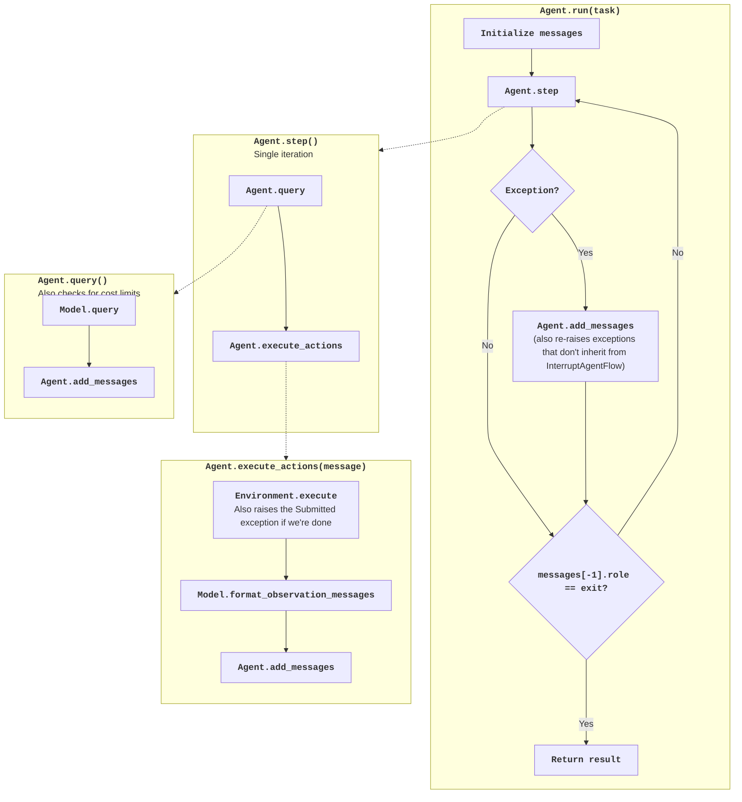

# Agent control flow

!!! note "Understanding AI agent basics"

    We also recently created a long tutorial on understanding the basics of building an AI agent: [View it here](https://minimal-agent.com).

!!! abstract "Understanding the default agent"

    * This guide shows the control flow of the default agent.
    * After this, you're ready to [remix & extend mini](cookbook.md)

The following diagram shows the control flow of the mini agent:



And here is the code that implements it:

??? note "Default agent class"

    - [Read on GitHub](https://github.com/swe-agent/mini-swe-agent/blob/main/src/minisweagent/agents/default.py)
    - [API reference](../reference/agents/default.md)

    ```python
    --8<-- "src/minisweagent/agents/default.py"
    ```

Essentially, `DefaultAgent.run` calls `DefaultAgent.step` in a loop until the agent has finished its task.

The `step` method is the core of the agent:

```python
def step(self) -> list[dict]:
    return self.execute_actions(self.query())
```

It does the following:

1. Queries the model for a response based on the current messages (`DefaultAgent.query`, calling `Model.query`)
2. Executes all actions in the response (`DefaultAgent.execute_actions`, calling `Environment.execute` for each action)
3. Formats the observation messages via `Model.format_observation_messages`
4. Adds the observations to the messages

Here's `query`:

```python
def query(self) -> dict:
    # ... limit checks ...
    message = self.model.query(self.messages)
    self.add_messages(message)
    return message
```

And `execute_actions`:

```python
def execute_actions(self, message: dict) -> list[dict]:
    outputs = [self.env.execute(action) for action in message.get...
    return self.add_messages(*self.model.format_observation_messages(...))
```

The interesting bit is how we handle error conditions and the finish condition:
This uses exceptions that inherit from `InterruptAgentFlow`. All these exceptions carry messages that get added to the trajectory.

- `Submitted` is raised when the agent has finished its task. For example, the environment checks if the command output starts with a magic string:

    ```python
    # In Environment.execute
    def _check_finished(self, output: dict):
        lines = output.get("output", "").lstrip().splitlines(keepends=True)
        if lines and lines[0].strip() == "COMPLETE_TASK_AND_SUBMIT_FINAL_OUTPUT":
            raise Submitted({"role": "exit", "content": ..., "extra": {...}})
    ```

- `LimitsExceeded` is raised when we hit a cost or step limit
- `FormatError` is raised when the output from the LM is not in the expected format
- `TimeoutError` is raised when the action took too long to execute
- `UserInterruption` is raised when the user interrupts the agent

The `DefaultAgent.run` method catches these exceptions and handles them by adding the corresponding messages to the messages list. The loop continues until a message with `role="exit"` is added.

```python
while True:
    try:
        self.step()
    except InterruptAgentFlow as e:
        self.add_messages(*e.messages)
    if self.messages[-1].get("role") == "exit":
        break
```

Using exceptions for the control flow is a lot easier than passing around flags and states, especially when extending or subclassing the agent.


